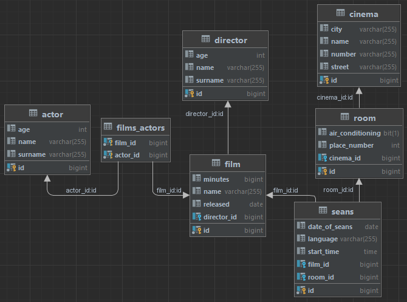

# About

The project presents a database implementation for films using hibernate.

Includes Rest Api implementation for the entities, CRUD.

Includes data paging.

# Technologies

- Spring Boot / Java
- Maven
- Hibernate
- MySQL

# Database schema

The structure is generated by Hibernate property in ```src/main/resources/application.properties``` file.



## Entities

- Film
- Actor
- Room
- Directors
- Cinema
- Show

# How to run

1. Set your MySQL database connection in ```src/main/resources/application.properties``` file.
2. Run Projekt2Application class.

Default address of backend server is http://localhost:8080.

## Example database data.

In ```src/main/resources/data.sql``` file you can find examples of the data.

The data is not real, it is for testing purposes only.

You can insert them after hibernate generates the database.

# Usage Example

## Rest Api

***Highly recommended to use Postman.***

Each entity has basic CRUD Rest Api endpoints.

Film and Actor entities include additional endpoints and parameters options.

### Get list of objects from selected entity

**Requirements:**

Request type: GET

Endpoint: ```http://localhost:8080/api/``` {Plural name of entity}.

Example: http://localhost:8080/api/films

> Optional parameters:
>
> page - Default page is 0, allows you to select the exact page you want.
>
> Example: http://localhost:8080/api/films?page=2

Returns list of objects.

---

#### Additional list endpoint for Film entity with details

Example: http://localhost:8080/api/films/details

> Optional parameters:
>
> page - Default page is 0, allows you to select the exact page you want.
>
> Example: http://localhost:8080/api/films/details?page=2

Returns list of films, included information about Director and list of Actors.

---

#### Additional optional parameter for Actor list endpoint

> Optional parameters:
>
> page - Default page is 0, allows you to select the exact page you want.
>
> olderThan - Default is disabled, you can filter list of actors by their age.
>
> Example: http://localhost:8080/api/actors?olderThan=44&page=1

Returns list of actors filtered by parameters.

---

### Get single object from selected entity by ID.

**Requirements:**

Request type: GET

Endpoint: ```http://localhost:8080/api/``` {Plural name of entity}/{ID of element}.

Example: http://localhost:8080/api/actors/9

Returns single object.

---

#### Additional endpoint for Actor's film list

Example: http://localhost:8080/api/actors/1/films

This endpoint doesn't include paging.

Returns Actor's film list.

---

### Add single object to selected entity.

**Requirements:**

Request type: POST

JSON or XML format object in request body

Example of body object:

```
{
        "name": "Bartosz",
        "surname": "Joda",
        "age": 33,
        "filmsIds": [
            1,2,3,4,5
        ]
}
```

Endpoint: ```http://localhost:8080/api/``` {Plural name of entity}.

Example: http://localhost:8080/api/actors

Returns new object.

---

### Update single object from selected entity by ID.

**Requirements:**

Request type: PUT

JSON or XML format object in request body

Example of body object:

```
{
    "placeNumber": 80,
    "airConditioning": true,
    "seansIds": [
        1,2,3
    ]
}
```

Endpoint: ```http://localhost:8080/api/``` {Plural name of entity}/{ID of element}.

Example: http://localhost:8080/api/rooms/1

Returns updated object.

---

### Delete single object from selected entity by ID.

**Requirements:**

Request type: DELETE

Endpoint: ```http://localhost:8080/api/``` {Plural name of entity}/{ID of element}.

Example: http://localhost:8080/api/shows/2

Returns nothing, object is deleted.

---

# Summary

Project was made for learning purposes.

The last project in the 6th semester in this subject.

Use freely.
